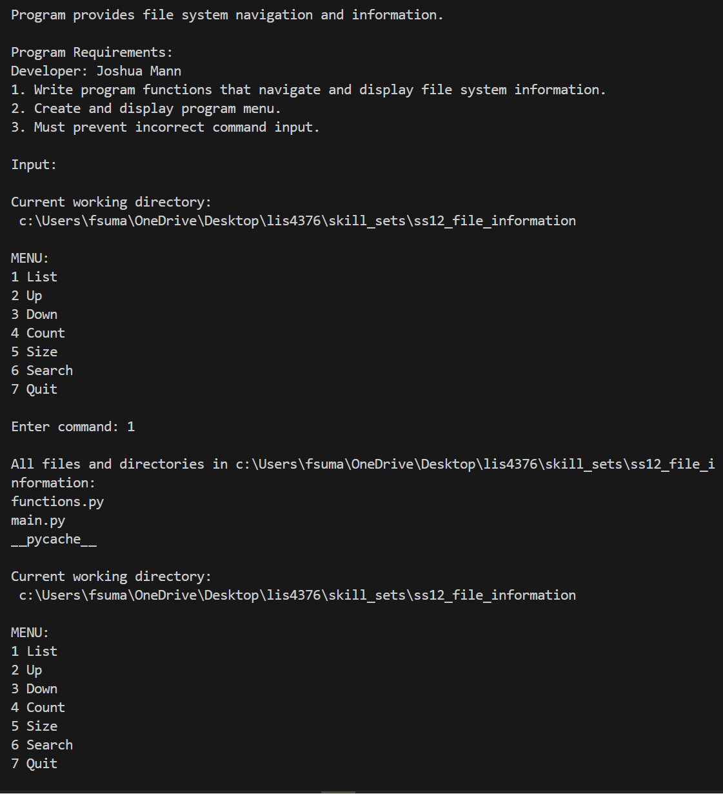

# LIS 4376: AI Applications

## Joshua Mann

### Assignment 4 Requirements:

1. Reverse engineer A4 video
2. Provide screenshots/gifs of A4 .ipynb file
3. Complete skillsets 10-12 and provide screenshots/gifs of running files

### README.md file should include the following items:

* Screenshots/Gifs of Skillsets
* Gif of A4
* Links to A4 Github and Skillset directories

## A4 Screenshots/Gifs:

---
## A4 Files and Links:

- [A4 .ipynb File](a4.ipynb)

## A4 Skillsets:

### Skillset 10 (Simple Shopping Cart):
- 

### Skillset 11 (Lists and Directories):
- 

### Skillset 12 (File Information):
- 

